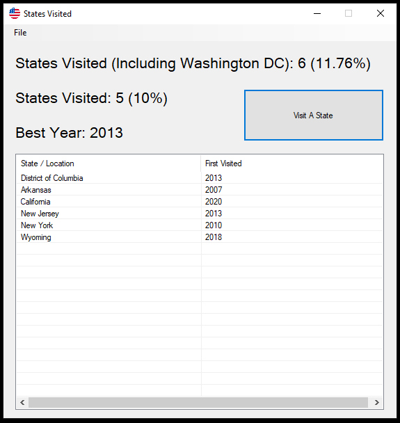
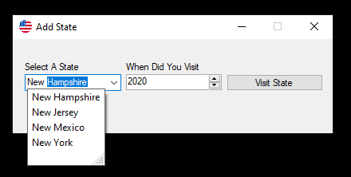
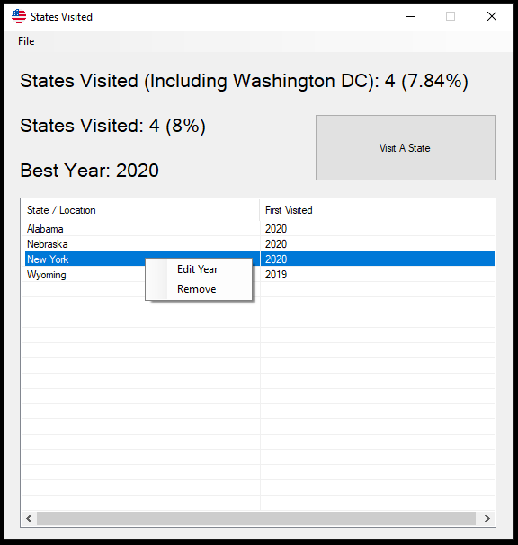

# StatesVisited
A lightweight GUI application based on C# and Windows Forms that keeps track of which states a user has visited

### Beta Features:
Note: While beta features are tested, they are not tested to the same standards as features available on master.
* Export data as:
  * StatesVisited File
    * This type of file is intended to backup data or share data between this application running on different machines
  * CSV File
    * Exports the data as a CSV file to be used with other applications
* Import data from:
  * StatesVisited File
  
These features can be found in the File Menu. More detailed documentation will be added when these features come out of beta.

### What is this project?
States Visited is a minimalistic, user-friendly application to keep track of which states you visit. It was created in June of 2019 as a personal project and was uploaded to GitHub in June of 2020. Functionality of the application can be seen in the screenshots below:

*Main Window (By default states will be alphabetized with District of Columbia at the top)*

*Adding a State (Uses autofill for user convenience)*

*Right-clicking a cell in the table opens the edit menu*

### How Can I Download and Install This Project?
As of right now, there is no installer. I may add one in the future, but for the time being, this is a Visual Studio 2019 Project. Therefore, the best way to run and install the project is to open the project file (the .sln file) in Visual Studio and compile it.

### How is This Project Licensed?
States Visited is licenced under GNU GPL 3.0.

### References
* The icon for this application was derived from: https://upload.wikimedia.org/wikipedia/commons/8/88/United-states_flag_icon_round.svg
